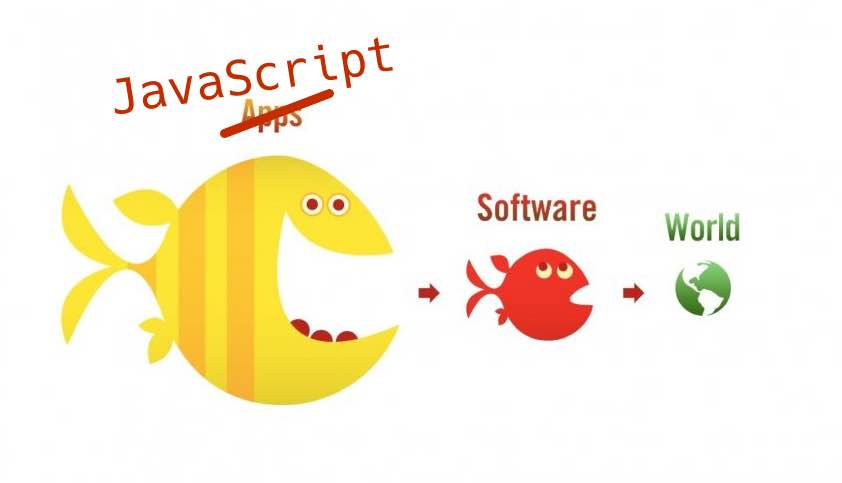

# Présentation de JavaScript

## TL;DR

* Historiquement créé pour animer les pages web, le langage JavaScript peut maintenant être utilisé pour programmer dans de très nombreux environnements : serveurs, applications mobiles, objets connectés...
* JavaScript est devenu essentiel pour de très nombreux développeurs. Il s'agit d'un excellent choix comme premier langage de programmation.
* Il a été standardisé sous le nom d'**ECMAScript** et subit des améliorations régulières.
* La version de JavaScript utilisée dans ce livre est **ES2015**, parfois appelée **ES6**. Bien que récente, elle est maintenant bien supportée.

## Histoire de JavaScript

JavaScript est avant tout le langage de programmation du Web. Il a été inventé en 1995 par [Brendan Eich](https://fr.wikipedia.org/wiki/Brendan_Eich), qui travaillait à l'époque pour la société [Netscape](https://fr.wikipedia.org/wiki/Netscape_Communications), créatrice du premier navigateur Web populaire (l'ancêtre de Firefox).

W> JavaScript ne doit pas être confondu avec le langage Java inventé à la même époque. Leurs syntaxes sont proches, mais leurs usages et leurs "philosophies" sont très éloignés. Consultez [cet article](http://www.js-attitude.fr/2012/09/17/javascript-n-a-rien-a-voir-avec-java/) pour plus de précisions à ce sujet.

L'idée de départ était de créer un langage simple pour rendre dynamiques et interactives les pages Web, qui étaient très simplistes à l'époque.

Petit à petit, les créateurs de sites Web ont enrichi leurs pages en y ajoutant du code écrit en JavaScript. Pour que le résultat fonctionne, il fallait que le navigateur Web (le logiciel qui sert à surfer sur la Toile en affichant les pages Web) comprenne le JavaScript. Ce langage a donc été progressivement intégré à l'ensemble des navigateurs. N'importe quel navigateur Web est aujourd'hui capable d'exécuter du code écrit en JavaScript.

L'explosion du Web puis l'avènement du Web 2.0, basé sur des pages riches et interactives, ont rendu JavaScript de plus en plus populaire. Les concepteurs de navigateurs Web ont optimisé la rapidité d'exécution du code JavaScript, jusqu'à en faire un langage très performant.

Cela a conduit à l'apparition en 2009 de la plate-forme [Node.js](https://fr.wikipedia.org/wiki/Node.js), qui permet d'écrire en JavaScript des applications Web très performantes ([plus de détails](https://openclassrooms.com/courses/des-applications-ultra-rapides-avec-node-js/node-js-mais-a-quoi-ca-sert)). Par l'intermédiaire de [MongoDB](https://fr.wikipedia.org/wiki/MongoDB), JavaScript a même pénétré le monde des bases de données (les logiciels qui ont pour rôle de stocker des informations de manière fiable et durable).

Enfin, l'arrivée des smartphones et autres tablettes dotés de systèmes différents et incompatibles (iOS, Android ou Windows Phone) a conduit à l'apparition d'outils de développement dits multi-plateformes. Ils permettent d'écrire en une seule fois des applications mobiles compatibles avec l'ensemble des terminaux du marché. Ces outils sont presque toujours basés sur... JavaScript !

## JavaScript : un langage essentiel

Ce petit résumé de l'histoire de JavaScript montre à quel point ce langage est maintenant présent partout. Il dispose d’un foisonnant écosystème de composants (des "briques de base" qu'on peut intégrer pour construire un logiciel) et d’une immense communauté de développeurs.

Sa connaissance vous ouvrira les portes de la programmation côté navigateur Web (on parle de développement *front-end*), côté serveur (*back-end*) ou côté mobile. A l'heure actuelle, beaucoup considèrent JavaScript comme la technologie la plus importante dans le monde du développement logiciel.

Sa dimension universelle conjuguée à sa facilité d'accès font de JavaScript un [excellent choix](https://medium.freecodecamp.com/what-programming-language-should-i-learn-first-%CA%87d%C4%B1%C9%B9%C9%94s%C9%90%CA%8C%C9%90%C9%BE-%C9%B9%C7%9D%CA%8Dsu%C9%90-19a33b0a467d#.3yu73z1px) comme premier langage pour débuter la programmation.

## Version utilisée dans ce livre

JavaScript a été standardisé en 1997 sous le nom d'[ECMAScript](https://fr.wikipedia.org/wiki/ECMAScript). Depuis, le langage a subi plusieurs séries d'améliorations pour corriger certaines maladresses initiales et supporter de nouvelles fonctionnalités.

Ce livre utilise une version récente du langage appelée **ES2015** (ou parfois **ES6**). Elle apporte des évolutions très intéressantes et est maintenant bien supportée par les principaux environnements JavaScript du marché, comme le montre cette [table de compatibilité](http://kangax.github.io/compat-table/es6/).
